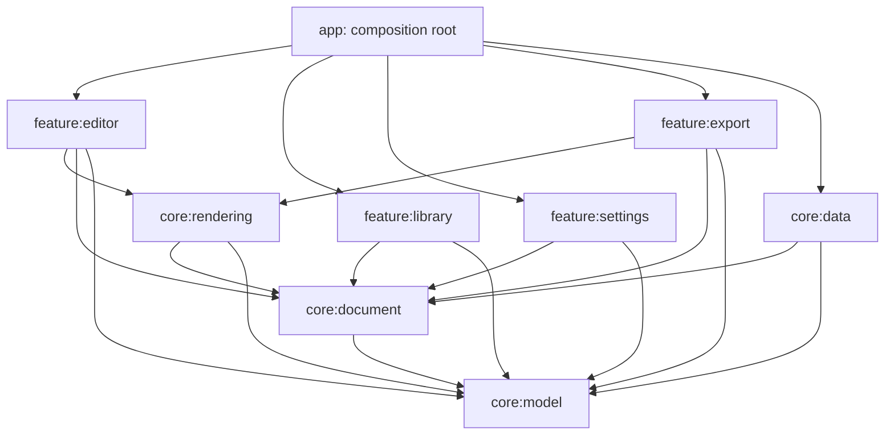
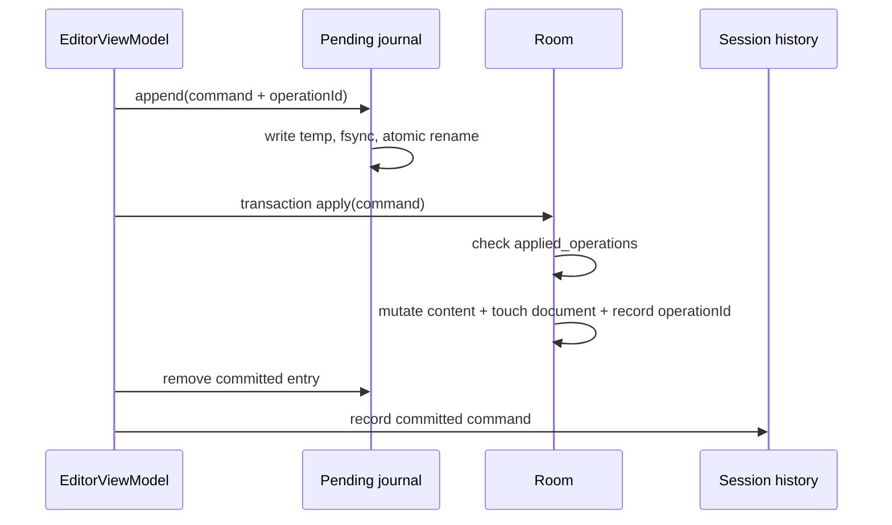
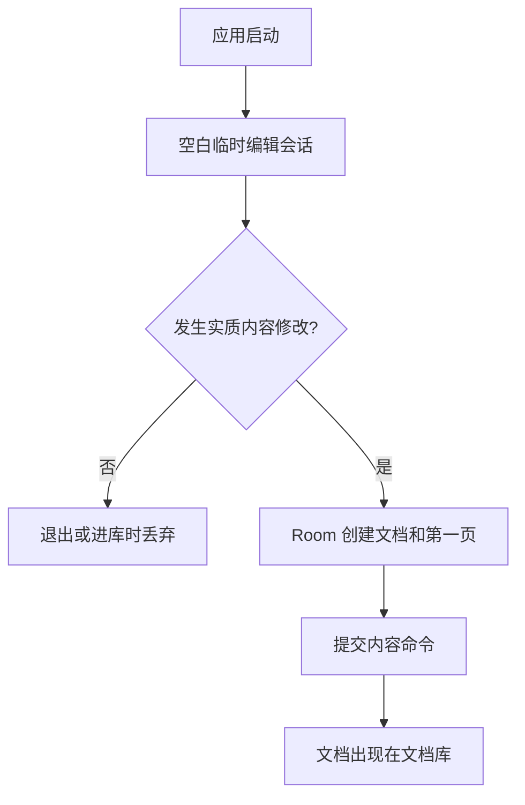

# 随手写架构与决策基线

本文档是 2026-07-19 大型重构后的架构基线，同时记录架构采访中已经确认的产品、数据、交互、可靠性和工程决策。后续实现必须以本文档和领域契约为约束；如果需要改变已确认决策，应先更新本文档，再修改代码。

文档中的“已实现”描述当前仓库事实，“规划边界”描述已经确定但当前 UI 尚未开放的能力。同步、账号、遥测、应用层加密和 CI 属于明确排除项，不应被当成待补功能。

## 1. 产品边界

“随手写”是一个永久仅本地运行的 Android 图片笔记与手写文档应用。

- 产品以本地文档库和多页文档为长期模型。
- 当前阶段编辑器只展示文档的一个活动页面，但领域模型、Room schema、快照和导出均按多页设计。
- 每次启动直接进入一份新的临时文档，不自动恢复或打开上次编辑的文档。
- 临时文档在第一次实质内容修改前不进入文档库。只切换工具、颜色、缩放或设置不算内容修改。
- 未修改的临时文档在退出、进入文档库或结束编辑会话时直接丢弃。这是采访中引用的 D42 决策。
- 文档内容只保存在本机，不建立账号、服务端、网络同步或跨设备同步。
- 不考虑实际打印。毫米、A4、DPI 和物理纸张尺寸不属于领域语义。
- 设计目标之一是导出尽可能小的图片笔记文件，因此图片编码、分辨率和压缩质量是导出策略的一部分。

## 2. 决策登记

原采访使用逐分支的 A/B/C 选择。为避免选项字母脱离问题后失去意义，以下统一重述最终决策。

| 编号 | 已确认决策 |
|---|---|
| D01 | 长期产品模型是“文档库 -> 多页文档 -> 有序页面元素”，当前 UI 可只展示单页。 |
| D02 | 应用永久仅本地运行，不设计账号、云同步或跨设备同步协议。 |
| D03 | 不申请网络能力，不加入遥测、崩溃上报或远程配置。 |
| D04 | 文档与页面内容以 Room 为唯一事实来源；Compose/ViewModel 状态只是会话投影。 |
| D05 | 设置由 Proto DataStore 持久化，与文档数据库分离。 |
| D06 | 页面坐标无单位，最长边固定为 65,535；不再使用毫米或打印 DPI。 |
| D07 | 历史 1:1.414 只保留为兼容视觉比例模板，不再称作 A4。 |
| D08 | 文档、页面、元素和资源使用本地 64 位 ID；操作幂等键使用 UUID 字符串。 |
| D09 | 将来导入原生文档时必须生成新的本地 ID，不保留包内 ID，也不做跨库 ID 合并。 |
| D10 | 页面和元素通过稳定的 orderKey 排序，默认以 1,024 为间隔追加。 |
| D11 | 每次应用启动都创建一个新的编辑会话并直接进入画布。 |
| D12 | 文档只在第一次实质内容修改时物化；空白临时会话不进入文档库。 |
| D42 | 未发生实质内容修改的临时文档在会话结束时自动丢弃。 |
| D13 | 返回键默认直接退出应用；设置可改为结束当前编辑会话并进入文档库。 |
| D14 | 打开已有文档会创建新编辑会话，不恢复上次会话的撤销栈。 |
| D15 | 撤销/重做只在当前编辑会话有效；重新打开文档只能看到最终内容。 |
| D16 | 不提供页面创建/删除的撤销功能。页面生命周期操作不进入命令历史。 |
| D17 | 清空当前页是可撤销的单个内容命令，不清空整个文档。 |
| D18 | 橡皮擦按整笔命中并删除，不做局部切割。 |
| D19 | 不提供用户图层。背景独立于有序 PageElement，当前 PageElement 仅包含笔迹。 |
| D20 | 图片和 PDF 可作为非破坏性页面背景；笔迹始终独立保存在其上。 |
| D21 | 外部背景始终复制到应用私有存储，不长期依赖来源 URI。 |
| D22 | 背景资源按 SHA-256 内容寻址、去重并通过引用计数管理。 |
| D23 | 所有设备使用固定顶部工具栏；空间不足时工具栏横向滚动，不切换为底部或浮动布局。 |
| D24 | 最小缩放为完整页面适配，对用户显示为 100%；最大缩放保持 400%。 |
| D25 | 支持手指绘制和仅手写笔两种输入模式；仅手写笔模式下手指用于平移和双指变换。 |
| D26 | 手写笔侧键可在设置中映射到受支持动作：按住临时橡皮、切换橡皮、撤销。 |
| D27 | 笔迹采样保留坐标、压力、倾斜和相对时间，持久格式不绑定 AndroidX Ink 对象。 |
| D28 | 不提供用户可见的图层系统，但领域排序为未来新增元素类型留出空间。 |
| D29 | 图片编码格式必须是设置项，支持自动、PNG、WebP 和 JPEG。 |
| D30 | 默认导出偏向较小文件：自动编码使用 WebP，有小/标准/高分辨率和三档压缩质量。 |
| D31 | 支持当前页图片、全部页面长图、混合 PDF、版本化原生 ZIP 四类导出。 |
| D32 | PDF 以路径绘制笔迹并栅格化背景，不引入打印尺寸或毫米语义。 |
| D33 | 导出基于一次 Room 事务快照，导出过程中后续编辑不改变本次输出。 |
| D34 | 全应用同一时间只保留一个命名导出任务；WorkManager 使用 KEEP 策略。 |
| D35 | 原生 ZIP 必须有格式标识和版本号；不支持的版本必须拒绝，不能猜测解析。 |
| D36 | 旧版应用数据全部舍弃，不为重构前格式编写迁移。新的 v1 基线发布后，后续 schema 变更应正常提供迁移。 |
| D37 | 不做应用层加密，依赖 Android 应用沙箱和系统存储保护。 |
| D38 | 禁止云备份，但允许 Android 设备迁移复制完整持久数据。pending journal 不参与迁移。 |
| D39 | 当前不建立 CI，所有验证在本地统一任务中完成；GitHub Actions 以后单独决策。 |
| D40 | 发布构建启用 R8 代码压缩和资源压缩。 |
| D41 | 最低系统为 Android 12 / API 31，compileSdk 和 targetSdk 为 36。 |
| D43 | 文档删除是立即永久删除，需确认，不提供回收站或跨会话撤销。 |
| D44 | 文件夹和多页能力属于长期文档库边界；当前 UI 不用占位控件假装能力已开放。 |

## 3. 技术基线

| 项目 | 当前值 |
|---|---|
| Application ID / namespace | `com.xsgovo.handwrite` |
| 应用名称 | 随手写 |
| Gradle | 9.4.1 |
| Android Gradle Plugin | 9.2.1 |
| Kotlin | 2.2.21 |
| Java source/target | 17 |
| 构建 JDK | 21 |
| minSdk | 31 |
| compileSdk / targetSdk | 36 / 36 |
| UI | Jetpack Compose + Material 3 |
| 导航 | 类型安全 Navigation Compose |
| 依赖注入 | Hilt 2.60.1 |
| 文档数据库 | Room 2.8.4 |
| 设置 | Proto DataStore 1.2.1 |
| 二进制载荷 | Protobuf Lite 4.35.1 |
| 手写输入/显示 | AndroidX Ink 1.0.0 |
| 后台导出 | WorkManager 2.11.2 |
| 异步模型 | Coroutines + Flow + StateFlow |
| JVM 测试 | JUnit 4.13.2 |

应用采用单 Activity、Compose 和类型安全路由。Android 模块使用 Java 17 兼容级别，纯 Kotlin 模块使用 JDK 21 toolchain。

## 4. 模块和所有权

仓库包含 10 个 Gradle 模块：

| 模块 | 所有权 |
|---|---|
| `:app` | Application、Activity、全局主题状态、导航图、Hilt 应用入口、备份规则。 |
| `:core:model` | 纯 Kotlin 领域值对象、ID、页面几何、笔迹、背景、设置和错误类型。 |
| `:core:document` | Repository 契约、文档命令、当前会话历史、pending journal 契约和可靠写协调。 |
| `:core:data` | Room、DAO、Protobuf codec、DataStore、内容寻址资源库和 Hilt 持久化装配。 |
| `:core:rendering` | 编辑器干笔迹显示、背景解码、页面位图/PDF Canvas 渲染。 |
| `:core:designsystem` | Material 主题和共享视觉基础。 |
| `:feature:editor` | 画布、固定顶部工具栏、输入手势、编辑会话状态和内容命令。 |
| `:feature:library` | 文档列表、打开、新建和永久删除。 |
| `:feature:settings` | 输入、主题、导出、返回行为和侧键设置。 |
| `:feature:export` | 导出 UI、WorkManager worker、四种格式和原生 ZIP writer。 |

依赖方向：



约束：

- feature 模块之间不能直接依赖，由 `:app` 负责导航和组合。
- `:core:model` 不依赖 Android。
- `:core:document` 不知道 Room、DataStore、WorkManager 或 Compose。
- `:core:data` 实现契约但不拥有 UI 行为。
- AndroidX Ink 是采样与显示引擎，不是持久化格式，也不能泄漏到领域模型。

## 5. 领域模型

核心聚合关系：

```text
Library
└── Document
    ├── metadata
    ├── lastActivePageId
    └── ordered Pages (orderKey)
        ├── LogicalSize
        ├── PageBackground
        └── ordered PageElements (orderKey)
            └── StrokeElement
                ├── BrushStyle
                └── StrokeSamples
```

### 5.1 文档和页面

- `Document` 保存本地 ID、显示名称、文件夹引用、创建/修改时间、收藏标记和活动页 ID。
- 每个文档至少有一页；Repository 禁止删除最后一页。
- 页面和元素使用 `orderKey`，不以数组位置作为稳定身份。
- `DocumentSnapshot` 要求至少一页，并保证页面和元素顺序已经排序。
- 当前编辑器只观察 `lastActivePageId`。多页创建、删除、切换的数据 API 已完成，页面管理 UI 未实现。

### 5.2 坐标系统

- `LogicalCanvas.LONG_EDGE = 65_535`。
- 任意页面最长边必须恰好等于 65,535，另一边由比例换算。
- 坐标、笔宽、背景平移和裁剪都使用无单位逻辑空间。
- 页面显示和导出分别把逻辑空间映射到视口像素或输出像素。
- `LEGACY_PORTRAIT` 的比例来自历史 1000:1414，仅表示比例模板。
- 已建模模板包括 legacy portrait、3:4、4:3、1:1 和 9:16；当前设置 UI 尚未开放默认模板选择。

### 5.3 ID 和名称

- Document/Page/Element/Folder/Resource ID 都是本地 `Long`。
- Room 为文档、页面和资源分配 ID；编辑器为新元素生成进程内单调递增的 64 位 ID。
- `OperationId` 使用 UUID 并作为 Room 幂等键。
- 显示名称先做 NFC，唯一键做 NFKC + `Locale.ROOT` 小写。
- 名称最长 100 个 Unicode code point，禁止斜杠、反斜杠和控制字符。
- 当前数据库对 normalizedName 做全库唯一约束。
- 将来的原生包导入必须重建全部本地 ID 和引用关系。

### 5.4 笔迹

`StrokeSample` 持久化：

- `LogicalPoint`
- 0..65,535 压力
- 从本笔开始的相对毫秒
- 可选的 X/Y 倾斜，范围 -32,767..32,767

`BrushStyle` 持久化 brush ID、ARGB、逻辑笔宽、混合模式和压力敏感度。Protobuf 使用坐标差分以减小载荷。默认 brush 是 monoline，领域还定义 pressure pen 和 highlighter。

### 5.5 背景而非图层

`PageBackground` 是页面属性，不是 PageElement：

- 纯色
- 透明
- 横线或方格图案
- 图片/PDF 资源

资源背景支持模型级缩放、平移、旋转和裁剪；当前 UI 只提供导入和替换，尚未提供变换控件或 PDF 页选择器。PDF 导入当前使用第 1 页（index 0）。

## 6. 持久化

### 6.1 Room 是文档事实来源

`handwrite.db` 当前 schema version 为 1：

| 表 | 内容 |
|---|---|
| `library_items` | 文档/未来文件夹元数据、名称唯一键、父文件夹、深度、时间、收藏。 |
| `document_states` | 文档的 lastActivePageId。 |
| `pages` | 文档 ID、orderKey、逻辑尺寸和背景 Protobuf。 |
| `page_elements` | 页面 ID、orderKey、类型、载荷版本和 Protobuf bytes。 |
| `resources` | SHA-256、MIME、私有相对路径、字节数和引用计数。 |
| `applied_operations` | 已提交的 OperationId，用于命令幂等。 |

Room 是文档元数据、页结构、元素和资源引用关系的唯一事实来源。文件系统中的资源 bytes 是 Room 资源记录的外部载荷；pending journal 只是未完成写入的恢复介质，不是第二份文档状态。

所有以下操作使用 Room transaction：

- 新建文档及第一页
- 新建/删除页面
- 删除文档并调整背景引用
- 应用内容命令并记录幂等操作
- 加载一致性导出快照

重构前旧数据不迁移。当前数据库从 version 1 建立新的长期基线。

### 6.2 设置

`app_settings.pb` 使用 Proto DataStore 和 Lite runtime。DataStore 包含：

- 输入模式、主题
- 图片编码、导出分辨率、压缩质量
- 返回键行为
- 手写笔侧键动作
- 压力敏感度和活动 brush
- 颜色槽、活动颜色、笔宽
- 默认页面模板和默认背景

读取损坏时使用默认设置替换。当前设置 UI 已开放输入模式、侧键、主题、图片编码、压缩质量和返回行为；其余字段已持久化但部分尚无 UI。

## 7. 可靠写入和撤销

### 7.1 内容命令

当前可逆命令只有：

- `ReplaceElements`：原子替换一组页面元素，用于新增笔迹、整笔擦除和清空页。
- `UpdateBackground`：原子替换页面背景并调整资源引用计数。

命令写入流程：



如果进程在 Room commit 前后退出，应用启动时 `DurableCommandExecutor.recover()` 按 journal sequence 重放。Room 先检查 `applied_operations`，因此已经提交但 journal 尚未删除的命令不会重复应用。恢复和正常命令共享同一个 Mutex，避免交错。

Journal 存在 `noBackupFilesDir/pending_commands`，不会被云备份或设备迁移复制。

### 7.2 会话历史

- 撤销/重做只存在 `EditorViewModel` 内存中。
- 打开文档或建立新会话时清空历史。
- 上限为 100 条命令或估算 64 MiB，先到者生效。
- 新命令清空 redo 栈。
- 只有命令成功写入 Room 后才进入历史。
- 页面创建、删除、排序和文档删除不进入历史。

因此“撤销”是当前编辑会话能力，不是文档的持久版本历史。

## 8. 临时文档和导航

启动路由始终是带随机 sessionId 的 `EditorDestination(documentId = null)`。



实质修改包括新增笔迹、擦除已有内容、清空非空页、改变页面背景或导入资源背景。缩放、平移、工具、颜色、笔宽和应用设置不物化文档。

导航规则：

- 默认系统返回：`finishAndRemoveTask()`。
- 开启“返回键进入文档库”：结束当前 Editor back stack entry 并进入文档库。
- 工具栏文件夹按钮始终进入文档库并结束当前编辑会话。
- 文档库“新文档”创建新的临时 session。
- 打开已有文档使用新的 sessionId 和 documentId，加载最终持久内容，撤销栈为空。
- 进入设置后返回可继续同一编辑 back stack entry。
- 导出页面读取 documentId；未物化临时文档不能导出。

## 9. 输入、视口和显示

### 9.1 AndroidX Ink 边界

- `InProgressStrokes` 负责低延迟湿笔迹 authoring。
- 完成的 Ink Stroke 立即转换为自有 `StrokeSample`，随后通过可靠命令写入 Room。
- 已保存领域笔迹重建为 Ink Stroke，由 `CanvasStrokeRenderer` 绘制干笔迹。
- 持久格式不序列化 AndroidX Ink 类型，避免库升级绑死文档格式。
- 显示变换同时应用到 Android Canvas，并把逻辑坐标映射到页面矩形。

### 9.2 手势优先级

- 两指始终用于缩放和平移，并在 Initial pointer pass 消费。
- Finger 模式下单指可绘制。
- Stylus 模式下 stylus/eraser 绘制或擦除，单指触摸用于平移。
- 起笔在页面外时不创建笔迹。
- Ink mask 把湿笔迹限制在页面区域。
- 橡皮按逻辑半径命中笔迹任一采样点，然后删除整笔。
- 侧键根据设置执行临时橡皮、切换橡皮或撤销。

### 9.3 缩放和平移

- 100% 表示当前容器内完整页面适配，不表示一逻辑单位等于一像素。
- 缩放范围 100%..400%。
- 100% 时 pan 归零。
- pan 被限制在页面溢出范围，不能把整个页面移出视口。
- 所有设备保留固定顶部工具栏，窄屏通过横向滚动访问后续按钮。

## 10. 背景资源

导入流程：

1. 系统 `OpenDocument` 只提供输入流，不成为长期依赖。
2. 在 IO dispatcher 将 bytes 写入临时文件并同步计算 SHA-256。
3. 相同 SHA-256 复用已有资源记录和私有文件。
4. 新资源以 `filesDir/resources/<sha256>.<ext>` 保存。
5. 背景命令提交时增加新资源引用并减少旧资源引用。
6. 应用启动清理数据库中引用计数为 0 的资源。

支持所有 `image/*` MIME 和 `application/pdf`。编辑器和导出都从私有副本解码。图片/PDF 只是背景，替换或删除背景不会改变笔迹。

当前清理能删除 Room 已跟踪且引用为 0 的资源。若进程恰好在资源文件落盘后、Room 资源记录插入前退出，可能留下未跟踪文件；后续资源维护可增加目录与数据库的双向核对。

## 11. 文档库和多页边界

当前文档库已实现：

- 按规范化名称排序显示根文档
- 新建临时文档
- 打开已有文档
- 确认后永久删除文档
- 进入设置

领域/数据库已实现但 UI 尚未开放：

- 创建、删除和观察多页
- lastActivePageId
- 文件夹实体基础和最大 10 层深度模型
- 重命名 Repository
- 收藏字段

尚未实现：

- 页面缩略图、切换、排序和页面管理 UI
- 文件夹 CRUD 和移动
- 文档搜索、自定义排序、批量操作
- 重命名和收藏 UI
- 回收站

这些能力不得绕过现有 `DocumentRepository` 或把页面重新塞回单一 ViewModel 大对象。

## 12. 导出

### 12.1 一致性和调度

用户通过 Storage Access Framework 选择目标 URI。Worker 首先在一个 Room transaction 中读取 `DocumentSnapshot`，然后只使用该快照导出。

- WorkManager unique work name 为 `document-export`。
- `ExistingWorkPolicy.KEEP` 保证已有导出运行时不启动第二个导出。
- 输出流以 truncate/write 模式打开。
- 导出失败返回 WorkManager failure，UI 显示完成或失败消息。
- 导出不修改文档。

### 12.2 四种格式

| 格式 | 行为 |
|---|---|
| 当前页面图片 | 导出 lastActivePageId 对应页面；找不到时回退第一页面。 |
| 全部页面长图 | 按 page orderKey 纵向拼接，页面间留白。 |
| 混合 PDF | 每页一个 PDF page；背景以位图绘制，笔迹以 Canvas path 绘制。 |
| 原生 ZIP | `manifest.json` + 每页二进制笔迹 + 去重后的原始背景资源。 |

图片策略：

- SMALL 最长边 1,280
- STANDARD 最长边 2,048
- HIGH 最长边 3,072
- 长图最大 30,000 像素边长和 36,000,000 总像素
- LOW/BALANCED/HIGH 对应 65/82/95 质量
- AUTO 和 WEBP 使用 lossy WebP
- JPEG 强制不透明
- PNG 保留透明通道

默认设置为 AUTO + STANDARD + BALANCED，优先文件体积。

### 12.3 原生 ZIP 版本

- manifest format：`com.xsgovo.handwrite.package`
- manifest version：1
- page binary magic：`HWPG` 对应整数 `0x48575047`
- page binary version：1
- 页面采样使用坐标 delta、16 位压力/倾斜和毫秒时间
- 背景资源按 SHA-256 在包内去重

当前只实现 writer，尚未实现原生 ZIP importer。未来 importer 必须：

1. 先校验 format、manifest version、page magic 和 page version。
2. 拒绝未知必要字段或不支持版本。
3. 校验 ZIP 路径、资源哈希、大小上限和引用完整性。
4. 为文档、页面、元素和资源映射生成新的本地 ID。
5. 在事务中导入，失败时不留下半个文档。

## 13. 设置和默认值

当前用户可见设置：

| 设置 | 默认值 | 选项 |
|---|---|---|
| 输入模式 | Finger | Finger / Stylus only |
| 笔侧键 | 按住临时橡皮 | 临时橡皮 / 切换橡皮 / 撤销 |
| 主题 | 跟随系统 | 系统 / 浅色 / 深色 |
| 图片编码 | 自动 | 自动 / PNG / WebP / JPEG |
| 压缩质量 | 平衡 | 更小 / 平衡 / 高质量 |
| 返回键行为 | 退出应用 | 退出 / 进入文档库 |

已持久化但当前没有独立 UI 的设置包括导出分辨率、压力敏感度、brush 选择、默认页面模板和默认背景。编辑器顶部工具栏直接持久化活动颜色槽和笔宽。

## 14. 隐私、安全和备份

- Manifest 不声明 INTERNET 权限。
- 没有账号、网络客户端、同步、广告、遥测或崩溃上报 SDK。
- 不做应用层数据库或资源加密。
- 所有原始文档和资源保存在应用私有目录。
- 导出只写用户通过 SAF 明确选择的 URI。
- FileProvider 仅暴露声明路径并授予临时 URI 权限。

Android backup 配置：

- `allowBackup=true` 用于设备迁移。
- API 31+ `cloud-backup` 显式排除 root/file/database/sharedpref/external 及 device protected 各域。
- `device-transfer` 显式包含持久 root/file/database/sharedpref 及 device protected 各域。
- 旧版 full-backup 规则排除全部域。
- cache 和 `noBackupFilesDir` 不迁移，pending journal 因而不会把半完成命令带到另一台设备。

设备迁移必须同时包含 Room 数据库、DataStore 和 `filesDir/resources`，三者缺一会破坏引用完整性。

## 15. 并发和错误语义

- Room/文件 I/O 在 suspend API 或 IO dispatcher 中执行。
- 编辑器用 `writeMutex` 串行化同一 ViewModel 的用户写操作。
- `DurableCommandExecutor` 用独立 Mutex 串行化恢复和所有可靠命令。
- Room transaction 维护页面内容、文档修改时间、引用计数和幂等键的一致性。
- 导出用 WorkManager 脱离 Composable 生命周期运行。
- DataStore 通过单一实例串行更新。

`DomainResult` 将存储满、文档/页面/资源不存在、名称冲突、数据库不可用、包版本不支持、包无效和导出目标不可用表示为显式领域失败。取消异常继续传播，不转换成普通失败。

UI 当前将常见失败映射为简短 Snackbar。文档写失败时 journal 保留，下一次启动恢复；数据库中不存在的背景私有文件会报告资源丢失。

## 16. 构建、测试和发布

统一本地质量门：

```powershell
.\gradlew.bat --no-daemon verifyLocal
```

`verifyLocal` 显式覆盖：

- `:core:model`、`:core:document` 的 JVM test
- app、所有 Android core 和 feature 模块的 `testDebugUnitTest`
- app、所有 Android core 和 feature 模块的 Android lint
- `:app:assembleDebug`
- `:app:assembleRelease`
- Release R8 代码压缩和资源压缩

当前测试覆盖：

- 领域不变量、命名、页面和笔迹模型
- 当前会话命令历史与限额
- pending journal 顺序、追加和删除
- pending command / stroke / background Protobuf codec
- Room/设置映射
- EditorViewModel 的延迟物化、写入和撤销行为
- 原生 ZIP manifest、页面二进制和资源打包

本次重构还在 Samsung SM-X818U（API 设备）上验证：

- AndroidX Ink 落笔、干笔迹显示
- Room 持久化
- 撤销/重做
- 图片背景通过系统选择器导入并显示
- WorkManager 当前页 WebP 导出，输出同时包含背景和笔迹

当前不创建 GitHub Actions。发布签名、商店分发和 CI 属于后续独立决策。

## 17. 已实现状态

### 已实现

- 11 模块依赖边界和 Hilt composition root
- Room 文档库、多页 schema、页面 Repository 和一致性快照
- Proto DataStore 设置
- pending journal -> 幂等 Room write -> 启动恢复
- 当前会话撤销/重做
- 每次启动新临时文档和首次实质修改物化
- 文档列表、打开和永久删除
- AndroidX Ink authoring 与干笔迹 rendering
- Finger/Stylus 模式、双指变换、整笔橡皮、侧键映射
- 固定顶部工具栏、完整页面适配和 400% 上限
- 纯色、透明、图案、图片和 PDF 背景模型
- 图片/PDF 私有复制、SHA-256 去重、引用计数和启动清理
- 当前页图片、长图、混合 PDF 和原生 ZIP 导出
- 云备份禁用、设备迁移保留
- 本地统一质量门和压缩 Release 构建

### 已建模但 UI 未完成

- 多页管理和切换
- 文件夹、重命名、收藏
- 背景变换、裁剪和 PDF 页选择
- brush/压力敏感度、默认模板、默认背景和导出分辨率设置

### 尚未实现

- 原生 ZIP 导入
- 文档搜索、缩略图、批量操作和回收站
- 自动化 Compose/UI instrumentation 流程
- 资源目录与 Room 的双向完整性扫描
- Release 签名和分发自动化

### 明确不实现

- 云同步和跨设备同步
- 账号、服务端和网络协议
- 遥测、广告和远程配置
- 应用层加密
- 打印、毫米和 A4 物理尺寸语义
- 用户图层
- 跨会话撤销历史
- 页面操作撤销
- 当前阶段 CI

## 18. 演进规则

1. 新文档能力先进入 `:core:model` 和 `:core:document` 契约，再由 data/feature 实现。
2. feature 不得直接依赖另一个 feature。
3. 文档内容变更必须是 Room transaction；可撤销内容变更必须通过 `DocumentCommand`。
4. 可靠命令必须先写 journal，再写 Room，并用 OperationId 幂等。
5. 不得把 AndroidX Ink、Compose、Room entity 或 protobuf message 当作领域 API。
6. 新 PageElement 类型必须有独立 type、payloadVersion、codec、导出策略和未知版本处理。
7. 新资源类型必须经过私有复制、内容校验、哈希、引用计数和清理流程。
8. 原生格式变更必须升级相应版本并提供兼容矩阵；禁止无版本地改变二进制布局。
9. 导出必须从一致性快照读取，不能在渲染循环中观察实时 Flow。
10. 新模块必须加入 `verifyLocal` 的显式模块清单。
11. 当前 v1 发布后，Room schema 变化必须提交 schema 和 migration 测试；“舍弃旧数据”只适用于重构前版本。
12. 任何同步、加密、CI、用户图层或持久撤销提案都属于架构决策变更，不能作为普通实现细节直接加入。
