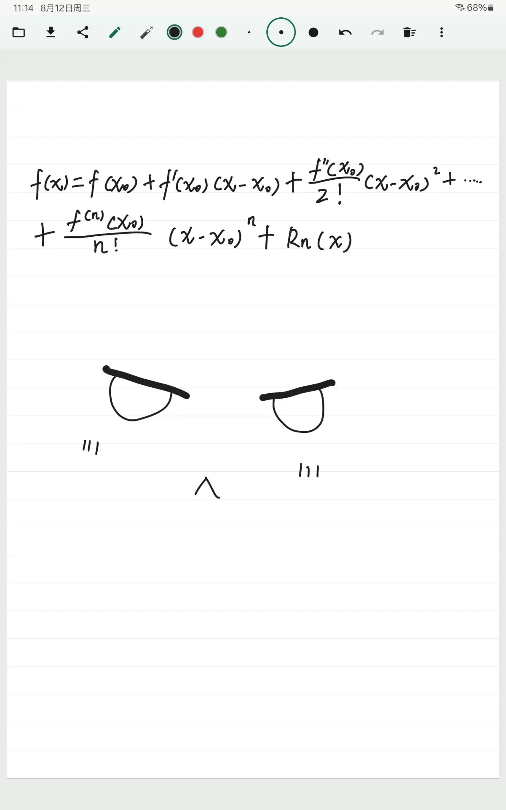

# 随手写

一个无需账号和网络服务、专为三星平板打造的完全本地运行的 Android 手写画板应用。使用手写笔或手指在画布上记录内容，并快速保存为图片来共享。



## 功能

- 手写笔迹输入，支持笔宽、颜色、橡皮擦和压力敏感度
- 撤销、重做和清空当前页面
- 白色、横线、方格以及图片/PDF 页面背景
- 文档库：新建、打开和永久删除文档
- 导出当前页面图片、全部页面长图、混合 PDF 或原生 ZIP 文档包
- 分享当前页面图片
- 输入方式、笔侧键动作、主题、图片格式和压缩质量设置

## 环境要求

- Android Studio
- JDK 17
- Android SDK 36
- Android 12（API 31）或更高版本的设备/模拟器

## 构建与运行

在项目根目录执行：

```powershell
# 构建 Debug APK
.\gradlew.bat :app:assembleDebug

# 运行项目的完整本地验证
.\gradlew.bat --no-daemon verifyLocal
```

Debug APK 默认生成在 `app/build/outputs/apk/debug/` 目录下。也可以使用 Android Studio 打开项目并运行 `app` 配置。

## 项目结构

```text
app/                 应用入口、导航和依赖组合
core/model/           领域模型
core/document/        文档命令、Repository 和可靠写入契约
core/data/            Room、DataStore 和文件资源持久化
core/rendering/       笔迹、背景和资源渲染
core/designsystem/    Compose UI 基础
feature/editor/       手写编辑器
feature/library/      文档库
feature/settings/     设置
feature/export/       文档导出
```

项目采用 Kotlin、Jetpack Compose、Room、DataStore、Hilt 和 AndroidX Ink 构建。详细架构约束见 [ARCHITECTURE.md](ARCHITECTURE.md)。
